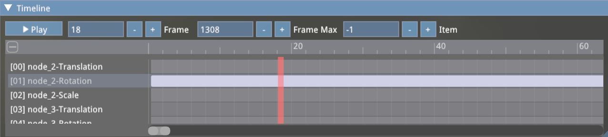

ImSequencer是基于Dear Imgui的技术的即时模式时间线控件，用于绘制动画的时间线(Timeline)。


{: .message }

1. 定义SequenceInterface的子类MySequence，该子类用于获取时间线的信息 
   SequenceInterface子类的成员说明如下：
   * **virtual int GetFrameMin()**  获取帧序号的最小值
   * **virtual int GetFrameMax()**  获取帧序号的最大值
   * **virtual int GetItemCount()** 获取时间线的行的个数
   * **virtual int GetItemTypeCount()**  获取行类型的个数
   * **virtual const char\* GetItemTypeName(int)**  获取类型的名称，我的例子中，类型为名称为Translation, Rotation, Scale, Weight四种
   * **virtual const char\* GetItemLabel(int)** 获取相应行的标题
   * **virtual const char\* GetCollapseFmt()** 获取当时间线卷起时的提示信息
   * **virtual void Get(int index, int\*\* start, int\*\* end, int\* type, unsigned int\* color)**  获取每行的信息，index-行号， start-起始帧编号， end-结束帧编号， type-类型， color-颜色
   * **virtual void Add(int type)**  增加一行，行的类型由type指定
   * **virtual void Del(int index)**  删除第index行
   * **virtual void Duplicate(int index)** 重复index行
   * **virtual void Copy()**  复制
   * **virtual void Paste()** 粘贴

   ##### 下面的几个接口用于绘制定制区域
   * virtual size_t GetCustomHeight(int)
   * virtual void DoubleClick(int)
   * virtual void CustomDraw()
   * virtual void CustomDrawCompact()

在我的应用中，使用MySequence子类定义如下：
```C++
static const char* SequencerItemTypeNames[] = { "Translation","Rotation", "Scale", "Weight"};

// Draw Sequence
struct MySequence : public ImSequencer::SequenceInterface
{
    int mFrameMin, mFrameMax;

    // interface with sequencer
    vkglTF::Animation *animation = nullptr;

    // my datas
    MySequence() : mFrameMin(0), mFrameMax(0) {}

    virtual int GetFrameMin() const {
        return 0;
    }
    virtual int GetFrameMax() const {
        if (!animation) return 1000;
        return animation->samplers[0].inputs.size() - 1;
    }
    virtual int GetItemCount() const {
        if (!animation) return 5;
        return (int)animation->channels.size();
    }

    virtual int GetItemTypeCount() const {
        return sizeof(SequencerItemTypeNames) / sizeof(char*);
    }

    virtual const char* GetItemTypeName(int index) const {
        if (index >= (sizeof(SequencerItemTypeNames) / sizeof(char*)))
            index = 0;
        return SequencerItemTypeNames[index];
    }

    virtual const char* GetItemLabel(int index) const
    {
        static char tmps[512];
        if (!animation) {
            snprintf(tmps, 512, "[%02d] None", index);
        } else {
            snprintf(tmps, 512, "[%02d] %s-%s",
                index, animation->channels[index].node->name.c_str(),
                GetItemTypeName(animation->channels[index].path));
        }
        return tmps;
    }

    virtual void Get(int index, int** start, int** end, int* type, unsigned int* color)
    {
        if (color)
            *color = 0xFFAA8080;
        if (start)
            *start = &mFrameMin;
        if (end)
            *end   = &mFrameMax;
        if (type && animation)
            *type = animation->channels[index].path;
    }
};
```

2. 定义mySequence对象
   ```C++
       MySequence mySequence;
   ```

3. 初始化mySequence
   在加载glTF模型后，如果该模型中带有动画，则根据其中的第1个动画初始化mySequence对象
   ```C++
   void initSequencer(uint32_t index)
   {
      if (!modelRenderer) return;

      if (index >= modelRenderer->getModel()->animations.size()) {
         mySequence.animation = nullptr;
         return;
      }
      mySequence.animation = &modelRenderer->getModel()->animations[index];
      mySequence.mFrameMin = 0;
      mySequence.mFrameMax = modelRenderer->getModel()->animations[index].samplers[0].inputs.size() - 1;
      modelRenderer->animationIndex = index + 1;
   }
   ```

4. 绘制时间线：
```C++
    void showSequencer()
    {
        if (!modelRenderer || !mySequence.animation)
            return;
        float xscale = 1.0f, yscale = 1.0f;
        glfwGetWindowContentScale(window, &xscale, &yscale);
        ImGui::SetNextWindowPos(ImVec2(0, height / yscale - 200));
        ImGui::SetNextWindowSize(ImVec2(width / xscale, 200));
        ImGui::Begin("Sequencer");
        // let's create the sequencer
        static int selectedEntry = -1;
        static int firstFrame = 0;
        static bool expanded = true;
        static int currentFrame = 100;

        ImGui::PushItemWidth(130);

        static std::string caption = ICON_MDI_PLAY "Play";
        if(ImGui::Button(caption.c_str(), ImVec2(80, 20))) {
            paused = !paused;
            if (paused) {
                caption = ICON_MDI_PLAY "Play";
            } else {
                caption = ICON_MDI_PAUSE "Pause";
            }
        }
        ImGui::SameLine();
        ImGui::InputInt("Frame ", &currentFrame);
        ImGui::SameLine();
        ImGui::InputInt("Frame Max", &mySequence.mFrameMax);
        ImGui::SameLine();
        ImGui::InputInt("Item", &selectedEntry);
        if (selectedEntry >= 0 && selectedEntry < mySequence.GetItemCount()) {
            uint32_t index = mySequence.animation->channels[selectedEntry].samplerIndex;
            switch (mCurrentGizmoOperation) {
            case ImGuizmo::OPERATION::TRANSLATE:
                ImGui::SameLine();
                ImGui::InputFloat3(ICON_MDI_ARROW_ALL "Location", glm::value_ptr(mySequence.animation->samplers[index].outputsVec4[currentFrame]));
                break;
            case ImGuizmo::OPERATION::ROTATE:
                ImGui::SameLine();
                ImGui::InputFloat4(ICON_MDI_ROTATE_ORBIT "Rotation", glm::value_ptr(mySequence.animation->samplers[index].outputsVec4[currentFrame]));
                break;
            case ImGuizmo::OPERATION::SCALE:
                ImGui::SameLine();
                ImGui::InputFloat3(ICON_MDI_ARROW_EXPAND_ALL "Scale", glm::value_ptr(mySequence.animation->samplers[index].outputsVec4[currentFrame]));
                break;
            default:
                break;
            }
        }
        ImGui::PopItemWidth();

        if (!paused) {
            if (animationTimer > mySequence.animation->samplers[0].inputs[currentFrame + 1])
                currentFrame++;
            if (currentFrame >= mySequence.mFrameMax) {
                currentFrame = 0;
            }
        }
        Sequencer(&mySequence, &currentFrame, &expanded, &selectedEntry, &firstFrame, ImSequencer::SEQUENCER_EDIT_ALL);
        // add a UI to edit that particular item
        if (selectedEntry != -1)
        {
            if (selectedEntry < mySequence.animation->channels.size()) {
                selectedNode = mySequence.animation->channels[selectedEntry].node;
                switch (mySequence.animation->channels[selectedEntry].path) {
                case vkglTF::AnimationChannel::PathType::TRANSLATION:
                    mCurrentGizmoOperation = ImGuizmo::OPERATION::TRANSLATE;
                    break;
                case vkglTF::AnimationChannel::PathType::ROTATION:
                    mCurrentGizmoOperation = ImGuizmo::OPERATION::ROTATE;
                    break;
                case vkglTF::AnimationChannel::PathType::SCALE:
                    mCurrentGizmoOperation = ImGuizmo::OPERATION::SCALE;
                    break;
                default:
                    mCurrentGizmoOperation = ImGuizmo::OPERATION::TRANSLATE;
                }
            }
        }
        if (paused) {
            animationTimer = mySequence.animation->samplers[0].inputs[currentFrame];
        }
        ImGui::End();
    }
```
#### 附：最终的效果如下图：
